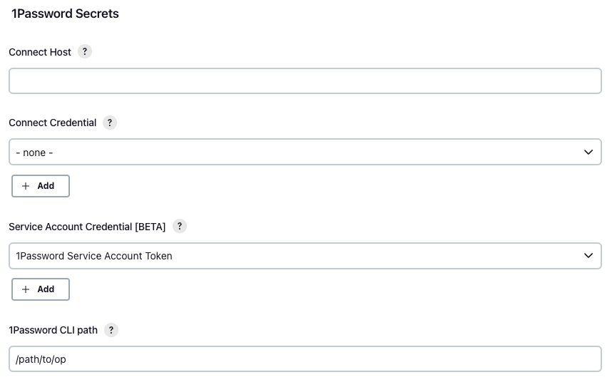
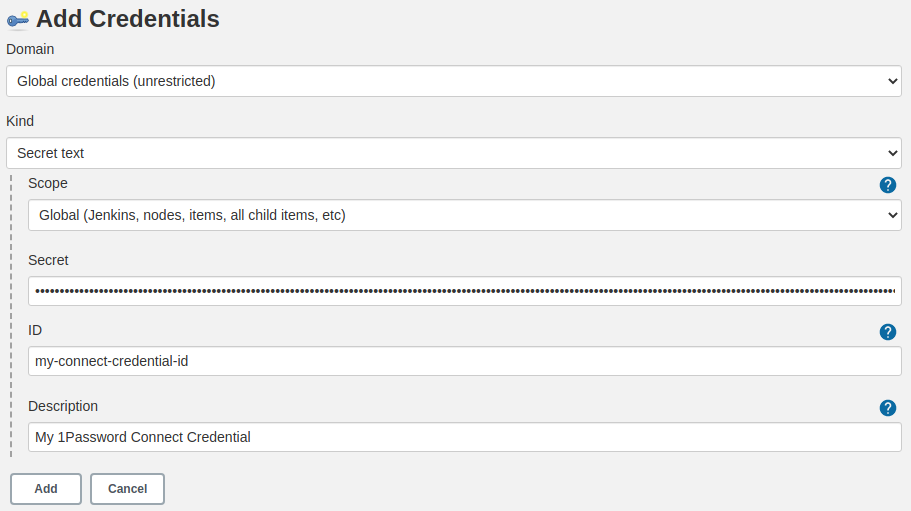
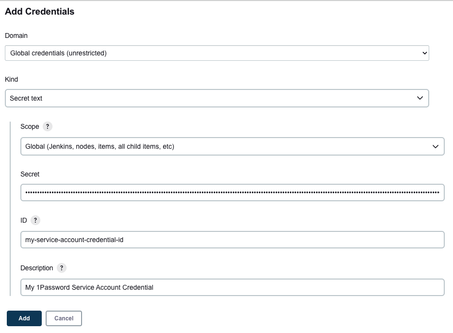
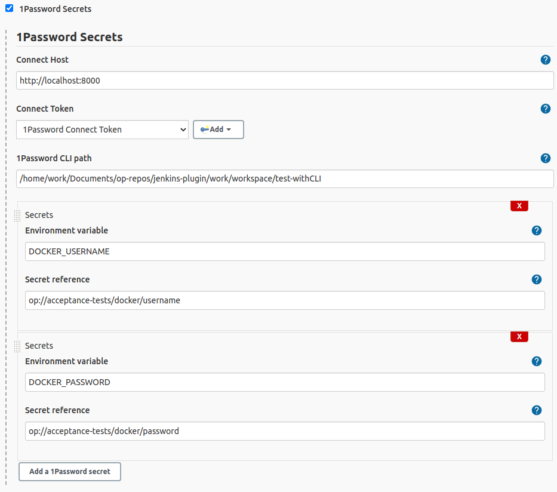

# 1Password Secrets plugin for Jenkins

This plugin loads secrets from a [1Password Connect server](https://developer.1password.com/docs/connect) or [1Password Service Account](https://developer.1password.com/docs/service-accounts) as environment variables into the Jenkins CI/CD pipeline. The loaded secrets can only be accessed witin the scope of the plugin.

Read more on the [1Password Developer Portal](https://developer.1password.com/docs/ci-cd/jenkins).

## Prerequisites

If you're using 1Password Connect, then you'll need to:

- [Set up a Secrets Automation workflow](https://developer.1password.com/docs/connect/get-started#step-1-set-up-a-secrets-automation-workflow).
- [Deploy 1Password Connect](https://developer.1password.com/docs/connect/get-started#step-2-deploy-1password-connect-server) in your infrastructure.

If you're using 1Password Service Accounts <sup>BETA</sup>, then you'll need to [create a service account](https://developer.1password.com//docs/service-accounts/).

## Install the 1Password CLI

This plugin relies on the 1Password CLI. You need to [Install 1Password CLI](http://developer.1password.com/docs/cli/get-started#install) on your host machine.

If you plan to install 1Password CLI in the same pipeline where you'll use the plugin, you need to add the installation script before you make any calls to the plugin.

If you install 1Password CLI in a separate build, you need to set the `1Password CLI path` to the workspace where you performed the installation in your [configuration](#configuration).

Here's an example script to install the 1Password CLI version `2.16.1` on a Linux `amd64` host:

```shell
curl -sSfLo op.zip https://cache.agilebits.com/dist/1P/op2/pkg/v2.16.1/op_linux_amd64_v2.16.1.zip
unzip -o op.zip
rm op.zip
```

<details>
<summary><b>Example installation via pipeline script</b></summary>

_Declarative Jenkinsfile_

```groovy
pipeline {
    agent any
    stages {
        stage('Install 1Password CLI') {
            sh '''
            curl -sSfLo op.zip https://cache.agilebits.com/dist/1P/op2/pkg/v2.16.1/op_linux_amd64_v2.16.1.zip
            unzip -o op.zip
            rm op.zip
            '''
        }
    }
}
```

_Scripted Jenkinsfile_

```groovy
node {
    stage('Install 1Password CLI') {
        sh '''
        curl -sSfLo op.zip https://cache.agilebits.com/dist/1P/op2/pkg/v2.16.1/op_linux_amd64_v2.16.1.zip
        unzip -o op.zip
        rm op.zip
        '''
    }
}
```

</details>

<details>
<summary><b> Example installation via Freestyle Project</b></summary>


</details>

See the most recent [1Password CLI release](https://app-updates.agilebits.com/product_history/CLI2).

**NOTE:** If you want to use Service Accounts <sup>BETA</sup>, then you'll need to install the latest beta version of the 1Password CLI (`2.16.0-beta.01` or later).

## Configuration

You can configure the plugin at three different levels:

- **Global**: Add to your global configuration. Impacts all folders and jobs.
- **Folder**: Configuration applies to the folder where your job is running.
- **Job level**: Configure the plugin either on your freestyle project job or directly in the Jenkinsfile. Applies only to that job.

The lower the level, the higher its priority. For example, if you configure a Connect server host in your global settings, but override it in a particular job, the Connect host configured at the job level will be used.

**NOTE:** If both a Connect server and service account are configured, the Connect server will take precedence.

### Configuration options

On your Jenkins configuration page, you'll see the following options:

| Setting                      | Description                                                                                                      |
| ---------------------------- | ---------------------------------------------------------------------------------------------------------------- |
| `Connect Host`               | The host where the Connect server is deployed.                                                                   |
| `Connect Credential`         | A `Secret text` credential type that contains the 1Password Connect Token to get secrets from 1Password.         |
| `Service Account Credential` | A `Secret text` credential type that contains the 1Password Service Account Token to get secrets from 1Password. |
| `1Password CLI path`         | The path to the 1Password CLI binary.                                                                            |

Jenkins 1Password Secrets configuration interface:



Create a Connect Credential by clicking Add next to Connect Token:



or Create a Service Account <sup>BETA</sup> Credential by clicking Add next to Service Account Token:


## Usage

### With a Jenkinsfile

To access secrets within the Jenkins pipeline, use the `withSecrets` function. This function receives the configuration and list of 1Password secrets to be loaded as parameters.

Here's an example of a declarative Jenkinsfile in which we configure to use Connect:

```groovy
// (Optional) Define the configuration values for your Connect Instance.
// If no configuration provided, a more broadly scoped configuration will be used (e.g. folder or global).
// Note the most granularly scoped configuration will have priority over all other configurations.
def config = [
        connectHost: 'http://localhost:8080',
        connectCredentialId: 'my-connect-credential-id',
        opCLIPath: '/path/to/op'
]

// Define the environment variables that will have the values of the secrets
// read using the secret reference `op://<vault>/<item>[/section]/<field>`
def secrets = [
    [envVar: 'DOCKER_USERNAME', secretRef: 'op://vault/item/username'],
    [envVar: 'DOCKER_PASSWORD', secretRef: 'op://vault/item/password']
]

pipeline {
    agent any
    stages{
        stage('Push latest docker image') {
            steps {
                // Environment variables will be set with the secrets specified by
                // the secret references within this block only.
                withSecrets(config: config, secrets: secrets) {
                    docker.withRegistry('http://somehost:5100') {
                        sh 'docker login -u ${DOCKER_USERNAME} -p ${DOCKER_PASSWORD} http://somehost:5100'
                        def	image = docker.build('somebuild')
                        image.push 'latest'
                    }
                }
            }
        }
    }
}
```

<details>
<summary><b> Scripted Jenkinsfile with Connect configured</b></summary>

```groovy
node {
    // (Optional) Define the configuration values for your Connect Instance.
    // If no configuration provided, a more broadly scoped configuration will be used (e.g. folder or global).
    // Note the most granularly scoped configuration will have priority over all other configurations.
    def config = [
        connectHost: 'http://localhost:8080',
        connectCredentialId: 'my-connect-credential-id',
        opCLIPath: '/path/to/op'
    ]

    // Define the environment variables that will have the values of the secrets
    // read using the secret reference `op://<vault>/<item>[/section]/<field>`
    def secrets = [
        [envVar: 'DOCKER_USERNAME', secretRef: 'op://vault/item/username'],
        [envVar: 'DOCKER_PASSWORD', secretRef: 'op://vault/item/password']
    ]

    stage('Push latest docker image') {
        // Environment variables will be set with the secrets specified by
        // the secret references within this block only.
        withSecrets(config: config, secrets: secrets) {
            docker.withRegistry('http://somehost:5100') {
                sh 'docker login -u ${DOCKER_USERNAME} -p ${DOCKER_PASSWORD} http://somehost:5100'
                def image = docker.build('somebuild')
                image.push 'latest'
            }
        }
    }
}
```

</details>

Here's an example of a declarative Jenkinsfile in which we configure to use Service Accounts <sup>BETA</sup>:

```groovy
// (Optional) Define the service account token that will be used.
// If no configuration provided, a more broadly scoped configuration will be used (e.g. folder or global).
// Note the most granularly scoped configuration will have priority over all other configurations.
def config = [
        serviceAccountCredentialId: 'my-service-account-credential-id',
        opCLIPath: '/path/to/op'
]

// Define the environment variables that will have the values of the secrets
// read using the secret reference `op://<vault>/<item>[/section]/<field>`
def secrets = [
    [envVar: 'DOCKER_USERNAME', secretRef: 'op://vault/item/username'],
    [envVar: 'DOCKER_PASSWORD', secretRef: 'op://vault/item/password']
]

pipeline {
    agent any
    stages{
        stage('Push latest docker image') {
            steps {
                // Environment variables will be set with the secrets specified by
                // the secret references within this block only.
                withSecrets(config: config, secrets: secrets) {
                    docker.withRegistry('http://somehost:5100') {
                        sh 'docker login -u ${DOCKER_USERNAME} -p ${DOCKER_PASSWORD} http://somehost:5100'
                        def	image = docker.build('somebuild')
                        image.push 'latest'
                    }
                }
            }
        }
    }
}
```

<details>
<summary><b> Scripted Jenkinsfile with Connect configured</b></summary>

```groovy
node {
    // (Optional) Define the service account token that will be used.
    // If no configuration provided, a more broadly scoped configuration will be used (e.g. folder or global).
    // Note the most granularly scoped configuration will have priority over all other configurations.
    def config = [
        serviceAccountCredentialId: 'my-service-account-credential-id',
        opCLIPath: '/path/to/op'
    ]

    // Define the environment variables that will have the values of the secrets
    // read using the secret reference `op://<vault>/<item>[/section]/<field>`
    def secrets = [
        [envVar: 'DOCKER_USERNAME', secretRef: 'op://vault/item/username'],
        [envVar: 'DOCKER_PASSWORD', secretRef: 'op://vault/item/password']
    ]

    stage('Push latest docker image') {
        // Environment variables will be set with the secrets specified by
        // the secret references within this block only.
        withSecrets(config: config, secrets: secrets) {
            docker.withRegistry('http://somehost:5100') {
                sh 'docker login -u ${DOCKER_USERNAME} -p ${DOCKER_PASSWORD} http://somehost:5100'
                def image = docker.build('somebuild')
                image.push 'latest'
            }
        }
    }
}
```

</details>

You can use the Jenkins Pipeline Syntax helper to generate a pipeline script, if you prefer.


### With environment variables

The plugin also allows you to use environment variables to get configuration and secrets.

For the configuration, you need to set up the following environment variables:

- `OP_CONNECT_HOST`
- `OP_CONNECT_TOKEN`
- `OP_CLI_PATH`

Here's an example configuration for Connect in a declarative Jenkinsfile:

```groovy
pipeline {
    agent any
    environment {
        // (Optional) Define the configuration values for your Connect Instance as environment variables.
        // If no configuration provided, a more broadly scoped configuration will be used (e.g. folder or global).
        // Note the most granularly scoped configuration will have priority over all other configurations.
        OP_CONNECT_HOST = 'http://localhost:8080'
        OP_CONNECT_TOKEN = credentials('my-connect-credential-id')
        OP_CLI_PATH = '/path/to/op'

        // Define the environment variables that will have the values of the secrets
        // read using the secret reference `op://<vault>/<item>[/section]/<field>`
        DOCKER_USERNAME = 'op://vault/item/username'
        DOCKER_PASSWORD = 'op://vault/item/password'
    }
    stages{
        stage('Push latest docker image') {
            steps {
                // Environment variables will be set with the secrets specified by
                // the secret references within this block only.
                withSecrets() {
                    docker.withRegistry('http://somehost:5100') {
                        sh 'docker login -u ${DOCKER_USERNAME} -p ${DOCKER_PASSWORD} http://somehost:5100'
                        def	image = docker.build('somebuild')
                        image.push 'latest'
                    }
                }
            }
        }
    }
}
```

<details>
<summary><b> Scripted Jenkinsfile</b></summary>

```groovy
node {
    def environment = [
        // (Optional) Define the configuration values for your Connect Instance as environment variables.
        // If no configuration provided, a more broadly scoped configuration will be used (e.g. folder or global).
        // Note the most granularly scoped configuration will have priority over all other configurations.
        'OP_CONNECT_HOST=http://localhost:8080',
        'OP_CLI_PATH = /path/to/op',

        // Define the environment variables that will have the values of the secrets
        // read using the secret reference `op://<vault>/<item>[/section]/<field>`
        'DOCKER_USERNAME=op://vault/item/username',
        'DOCKER_PASSWORD=op://vault/item/password'
    ]

    def credentials = [
        string(credentialsId: 'my-connect-credential-id', variable: 'OP_CONNECT_TOKEN')
    ]

    withEnv(environment) {
        withCredentials(credentials) {
            stage('Push latest docker image') {
                // Environment variables will be set with the secrets specified by
                // the secret reference within this block only.
                withSecrets() {
                    docker.withRegistry('http://somehost:5100') {
                        sh 'docker login -u ${DOCKER_USERNAME} -p ${DOCKER_PASSWORD} http://somehost:5100'
                        def image = docker.build('somebuild')
                        image.push 'latest'
                    }
                }
            }
        }
    }
}
```

</details>

Here's an example configuration for Service Accounts <sup>BETA</sup> in a declarative Jenkinsfile:

```groovy
pipeline {
    agent any
    environment {
        // (Optional) Define the service account token that will be used.
        // If no configuration provided, a more broadly scoped configuration will be used (e.g. folder or global).
        // Note the most granularly scoped configuration will have priority over all other configurations.
        OP_SERVICE_ACCOUNT_TOKEN = credentials('my-service-account-credential-id')
        OP_CLI_PATH = '/path/to/op'

        // Define the environment variables that will have the values of the secrets
        // read using the secret reference `op://<vault>/<item>[/section]/<field>`
        DOCKER_USERNAME = 'op://vault/item/username'
        DOCKER_PASSWORD = 'op://vault/item/password'
    }
    stages{
        stage('Push latest docker image') {
            steps {
                // Environment variables will be set with the secrets specified by
                // the secret references within this block only.
                withSecrets() {
                    docker.withRegistry('http://somehost:5100') {
                        sh 'docker login -u ${DOCKER_USERNAME} -p ${DOCKER_PASSWORD} http://somehost:5100'
                        def	image = docker.build('somebuild')
                        image.push 'latest'
                    }
                }
            }
        }
    }
}
```

<details>
<summary><b> Scripted Jenkinsfile</b></summary>

```groovy
node {
    def environment = [
        'OP_CLI_PATH = /path/to/op',

        // Define the environment variables that will have the values of the secrets
        // read using the secret reference `op://<vault>/<item>[/section]/<field>`
        'DOCKER_USERNAME=op://vault/item/username',
        'DOCKER_PASSWORD=op://vault/item/password'
    ]

    // (Optional) Define the service account token that will be used.
    // If no configuration provided, a more broadly scoped configuration will be used (e.g. folder or global).
    // Note the most granularly scoped configuration will have priority over all other configurations.
    def credentials = [
        string(credentialsId: 'my-service-account-credential-id', variable: 'OP_SERVICE_ACCOUNT_TOKEN')
    ]

    withEnv(environment) {
        withCredentials(credentials) {
            stage('Push latest docker image') {
                // Environment variables will be set with the secrets specified by
                // the secret reference within this block only.
                withSecrets() {
                    docker.withRegistry('http://somehost:5100') {
                        sh 'docker login -u ${DOCKER_USERNAME} -p ${DOCKER_PASSWORD} http://somehost:5100'
                        def image = docker.build('somebuild')
                        image.push 'latest'
                    }
                }
            }
        }
    }
}
```

</details>

### In Freestyle Jobs

If you use Freestyle Jobs, consider migrating to [Jenkinsfile](https://jenkins.io/doc/book/pipeline/)), With Jenkinsfile, you can set up both the [configuration](#configuration) and the secrets you need at the job level.



To add a secret to your Freestyle Job, click the "Add a 1Password secret" button in the 1Password Secrets section, then fill out the following fields:

| Field                  | Description                                                                                                                                                                       |
| ---------------------- | --------------------------------------------------------------------------------------------------------------------------------------------------------------------------------- |
| `Environment variable` | The name of the environment variable that will contain the loaded secret.                                                                                                         |
| `Secret reference`     | The 1Password secret reference using [secret reference syntax](https://developer.1password.com/docs/cli/secrets-reference-syntax): <br /> `op://<vault>/<item>[/section]/<field>` |

The secrets are available as environment variables.

[//]: # "See the [examples](./docs/examples) directory for more examples and use cases."

## Requirements

- Maven > 3.3.9
- Oracle JDK 11 or higher

## Security

1Password requests you practice responsible disclosure if you discover a vulnerability.

Please file requests through [**BugCrowd**](https://bugcrowd.com/agilebits).

For information about our security practices, please visit the [1Password Security homepage](https://1password.com/security).

## Getting help

If you find yourself stuck, visit our [**Support Page**](https://support.1password.com/) for help.

<!--
# onepassword-secrets

## Introduction

TODO Describe what your plugin does here

## Getting started

TODO Tell users how to configure your plugin here, include screenshots, pipeline examples and
configuration-as-code examples.

## Issues

TODO Decide where you're going to host your issues, the default is Jenkins JIRA, but you can also enable GitHub issues,
If you use GitHub issues there's no need for this section; else add the following line:

Report issues and enhancements in the [Jenkins issue tracker](https://issues.jenkins-ci.org/).

## Contributing

TODO review the default [CONTRIBUTING](https://github.com/jenkinsci/.github/blob/master/CONTRIBUTING.md) file and make sure it is appropriate for your plugin, if not then add your own one adapted from the base file

Refer to our [contribution guidelines](https://github.com/jenkinsci/.github/blob/master/CONTRIBUTING.md)

## LICENSE

Licensed under MIT, see [LICENSE](LICENSE.md)
-->
